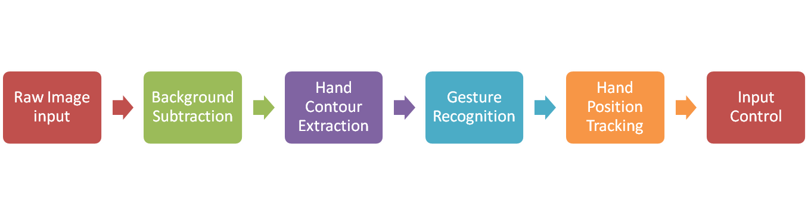

# CE264-Computer Vision
Repository for project code of CE264 Computer Vision

## Application of Hand-gesture Recognition Technology Using OpenCV


The following is draft flow chart of porject program:



Some material for each subtasks

- [x] Row Image Input

   * [GUI feature in OpenCV](http://docs.opencv.org/3.0-last-rst/doc/py_tutorials/py_gui/py_table_of_contents_gui/py_table_of_contents_gui.html#py-table-of-content-gui)

- [ ] Background Subtraction

    * [Change BGR to HSV or YIQ](http://docs.opencv.org/3.0-last-rst/doc/py_tutorials/py_imgproc/py_colorspaces/py_colorspaces.html#converting-colorspaces)
    * [Do erode and dilate](http://docs.opencv.org/3.0-last-rst/doc/py_tutorials/py_imgproc/py_morphological_ops/py_morphological_ops.html#morphological-ops)

- [ ] Hand Contour Extraction

    * [Draw Contour and Find Convex Hull or Convexity Defects](http://docs.opencv.org/3.0-last-rst/doc/py_tutorials/py_imgproc/py_contours/py_table_of_contents_contours/py_table_of_contents_contours.html#table-of-content-contours)

- [ ] Gesture Recognition


- [ ] Hand Position Tracking


- [ ] Input Control

    * [PyAutoGUI](http://pyautogui.readthedocs.org/en/latest/cheatsheet.html)
    * [PyUserInput](https://github.com/SavinaRoja/PyUserInput)

    For instal PyAutoGUI on Linux (for python 2.x):
    
    ``` bash
    # install x-lib and scrot (pip not work for me)
    $ sudo apt-get install  python-xlib
    $ sudo apt-get install scrot
    
    # skip install python-tk and python2.x-dev (already had)
    # instal Pyautogui
    $ sudo pip install pyautogui
    ```

